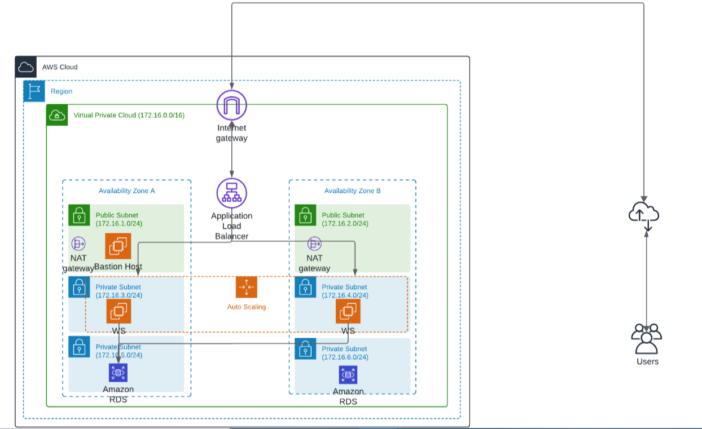

# Proyecto-Bootcamp
Proyecto final despliegue infraestructura altamente disponible
# *1. Planificación*
# *1.1 Identificar Roles*
## - Administrador de nube y servidores: derechos de administración (acceso a todo AWS).
## - Desarrollador: acceso solamente a AWS Cloud9.
## - Administrador de servidor Web y Base de Datos: full acceso Amazon EC2, RDS y System Manager (parameter Store)
## - Equipo de soporte de Almacenamiento: puede ver solamente los buckets creados en S3.
## - Auditor - Accesos: Accesos de solo lectura Amazon EC2, RDS, IAM.
## - Usuario de Consulta: Accesos de solo lectura Amazon EC2, RDS.
# *1.2 Diagrama de Gantt

# 1.3* Requerimientos
## - Requerimiento 1 
# Desarrollar la plataforma web que permita a los clientes explorar los diferentes libros.
## - Requerimiento 2
# Implementar la red en la nube de AWS con 6 subredes: dos públicas y cuatro privadas. Para garantizar Alta disponibilidad, se usaran dos zonas de disponibilidad (zona A y zona B).
## - Requerimiento 3
# La subred pública actuará como la puerta de entrada a la plataforma en línea, brindando a los usuarios acceso a internet y una experiencia de navegación
# fluida a traves del balanceador de carga. Se usara un auto scaling para redirigir volumen de tráfico creando nuevas instancias que permitan mantener equilibrado ese tráfico.
## - Requerimiento 4
# Las subredes privadas  estarán protegidas contra accesos no autorizados desde internet garantizando la seguridad de los datos sensibles de la librería.
## - Requerimiento 5
# La instancia EC2 debe poder conectarse a la base de datos en la subred privada. Para facilitar la conexión se implementarán parámetros de configuración de la base de datos RDS en el AWS System Manager Parameter Store,
# garantizando acceso seguro y eficiente a los datos almacenados.
## - Requerimiento 7
# Se debe garantizar consultas al modulo de calificaciones y contactenos dentro de la pagina del cliente.
# - Requerimientos No funcionales
## - Requerimiento 8
# El Framework usado para la pagina web esta flask y el motor de la Base de Datos se encuentra en MariaBD.
# El despliegue por codigo ha sido diseñado en Python
# Se aplican pruebas de stress y de carga. Adicionalmente se asigna al usuario solicitante un acceso para ingresar y validar la funcionalidad de la pagina.
# Se ejecutan pruebas de escalabilidad, y HA para comprobar alta disponibilidad. 
# Legislaciones de Derechos de Autor (recomendacion al usuario solicitante para evitar incurrir en posibles amonestaciones de ley).
## 1.4* Arquitectura
Este es el diagrama de arquitectura para una infraestructura altamente disponible en una libreria.

# Ejecucion
## Se utilizó el servicio de cloudoformation que es un servicio de infraestructura como código para realizar el despliegue de la arquitectura. Utilizamos el siguiente comando para realizar el despliegue de la arquitectura:
## Realizar la validacion de los template network.yml
### aws cloudformation validate-template --template-body file://network.yml
### aws cloudformation create-stack --stack-name network-stack --template-body file://network.yml
## Crear VPC
### CIDR: 172.16.0.0/16
## Crear 6 subredes en dos zonas de disponibilidad diferentes:
### PublicSubnetA: 172.16.1.0/24 - Availability Zone A
### PublicSubnetB: 172.16.2.0/24 - Availability Zone B
### PrivateSubnetA: 172.16.3.0/24-Availability Zone A
## Crear Route Table
Asociar con las dos subredes públicas
## Crear ruta para salida a internet
## Crear dos NatGateway
Uno se crea en la PublicSubnetA
El otro se crea en la PublicSubnetB
## Asociar cada NatGateway con una PrivateSubnet
## Crear las rutas para salida a internet.
## Crear grupos de seguridad:
### Grupo para la instancia en la subred publica
### Grupo para la instancia en la subred privada
### Grupo para la base de datos
### Grupo de seguridad para el balanceador de cargas
## Crear Rol IAM con los siguientes permisos:
### S3FullAccess
### SSMFullAccess
#### Asociar Rol a instancia EC2
### PrivateSubnetB: 172.16.4.0/24 - Availability Zone B
### PrivateSubnetAA: 172.16.5.0/24-Availability Zone A
### PrivateSubnetBB: 172.16.6.0/24 - Availability Zone B
## Crear Internet Gateway
Conectar con la VPC creada.
Asociar dos subredes públicas.

# Seguimiento y Control
## Recomendaciones en la entrega del proyecto
# Todos los requerimientos mencionados en el documento, son entregados a conformidad del solicitante. Cualquier tipo 
# de Cambio fuera de los requerimientos establecidos seran evaluados y presupuestados en un proyecto nuevo. El
# Soporte tendrá como alcance unicamente los recursos desplegados durante el desarrollo del proyecto y no seran incluidos nuevos requerimientos.
